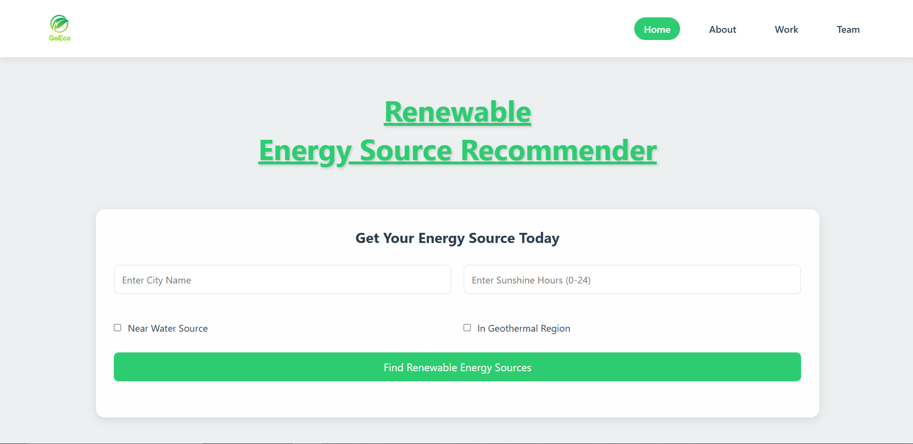

<p align="center">
  
</p>

# GoEco

**GoEco** is a web application that tackles the issue of sustainable energy selection. It helps users identify the most suitable renewable energy source for their location based on current weather conditions.



<!--line-->


## 🌟 Features

- 🔍 Real-time weather data integration using the [WeatherAPI](https://www.weatherapi.com/) to assess temperature, wind speed, cloud cover, and rainfall.
- ⚡ Predicts the **best renewable energy source** (solar, wind, hydro, geothermal) for a given location.
- 💰 Calculates **government incentives**, **carbon reduction**, **installation cost**, **money saved**, and **return on investment (ROI)**.
- 🛍 Intuitive UI to input city, sunshine hours, proximity to water sources, and geothermal activity.

---

## 🛠 Tech Stack

- HTML, CSS, JavaScript
- Python, Flask
- WeatherAPI

<!--line-->


### 🧪 Installation Steps

1. **Clone the repository**

   First, open your terminal or command prompt. Then, run the following command to download the GoEco project code to your local machine:

   ```bash
   git clone https://github.com/your-username/GoEco.git
   ```

   Navigate into the project directory:

   ```bash
   cd GoEco
   ```

2. **Create a virtual environment (optional but recommended)**

   This helps keep your project dependencies isolated.

   ```bash
   python -m venv venv
   ```

   Activate the virtual environment:

   - **Windows:**
     ```bash
     venv\Scripts\activate
     ```
   - **Mac/Linux:**
     ```bash
     source venv/bin/activate
     ```

3. **Install required packages**

   All dependencies are listed in the [`requirements.txt`](get-started/requirements.txt) file located in the Get Started section. Install them using:

   ```bash
   pip install -r get-started/requirements.txt
   ```

4. **Set up your WeatherAPI key**

   - Go to [WeatherAPI.com](https://www.weatherapi.com/) and sign up for a free account.
   - After verifying your email, you'll receive an API key.

   Now, set this key as an environment variable:

   - **Windows (Command Prompt):**
     ```bash
     set WEATHER_API_KEY=your_api_key_here
     ```
   - **Windows (PowerShell):**
     ```bash
     $env:WEATHER_API_KEY="your_api_key_here"
     ```
   - **Mac/Linux:**
     ```bash
     export WEATHER_API_KEY=your_api_key_here
     ```

   Alternatively, you can **hardcode** it in your `app.py` file:

   ```python
   API_KEY = os.getenv("WEATHER_API_KEY", "your_api_key_here")
   ```

5. **Run the Flask application**

   Once everything is set up, start the Flask server:

   ```bash
   python app.py
   ```

   If everything is configured correctly, you'll see output like:

   ```
   * Running on http://127.0.0.1:5000/ (Press CTRL+C to quit)
   ```

6. **Open the app in your browser**

   Go to [http://127.0.0.1:5000](http://127.0.0.1:5000) to use the GoEco web app locally.

<!--line-->


## 📌 Usage Guide

1. **Enter Location and Preferences**
   - On the Get Started or Service page, enter the city name and sunshine hours.
   - Optionally, check if the location is near a water source or in a geothermal region.

2. **Submit the Form**
   - Click on "Find Renewable Energy Sources" to trigger predictions.

3. **View Results**
   - Get detailed insights on:
     - Recommended energy source
     - Government incentives
     - Carbon emission reduction
     - Estimated installation cost
     - Total money saved
     - ROI (Return on Investment)

---

## 📄 License

This project is licensed under the **MIT License**. [View License](LICENSE)

Feel free to contribute, raise issues, or fork the repository to support sustainability!

